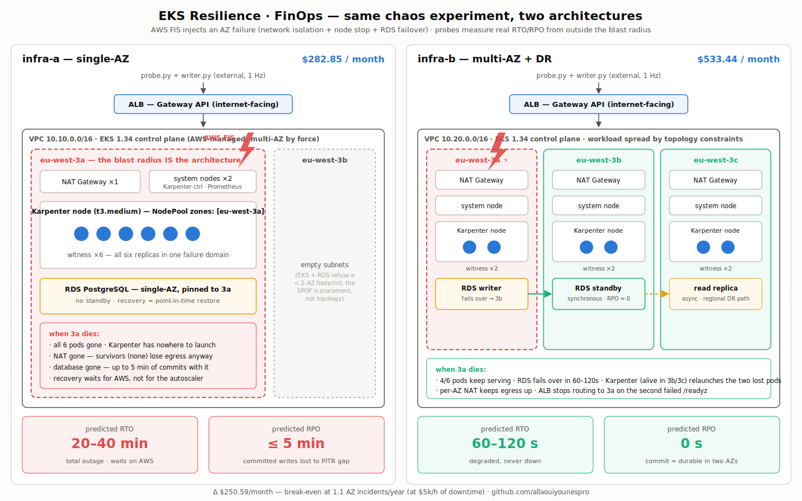

# EKS Resilience · FinOps

**What does high availability actually cost — and how often does an AZ have to
fail before it pays for itself?**

Production-grade AWS infrastructure that answers a question most design docs only
assert. Two EKS platforms are built from the same Terraform modules, differing
only in their resilience settings. The same chaos experiment (AWS FIS, full AZ
failure) is injected into both, real RTO/RPO are measured by probes running
*outside* the blast radius, and the results feed a cost model that solves the
break-even a CFO would actually ask for.

owner: **allaouiyounespro** · portfolio: [github.com/allaouiyounespro](https://github.com/allaouiyounespro)

* * *

## 📋 Table of Contents

- [🏗️ Architecture Overview](#%EF%B8%8F-architecture-overview)
- [🎯 The Question](#-the-question)
- [📁 Project Structure](#-project-structure)
- [🧩 Infrastructure Components](#-infrastructure-components)
- [🔬 How the Measurement Works](#-how-the-measurement-works)
- [💰 FinOps Considerations](#-finops-considerations)
- [🔒 Security Highlights](#-security-highlights)
- [🚀 Running It](#-running-it)
- [⚠️ What This Project Does Not Claim](#%EF%B8%8F-what-this-project-does-not-claim)
- [🛠️ Tech Stack](#%EF%B8%8F-tech-stack)

* * *

## 🏗️ Architecture Overview



Same modules, same region, same workload, same fault. The entire difference
between the $285.04/month architecture and the $507.54/month one is a **15-line
diff between two `main.tf` files**:

```console
$ diff terraform/stacks/infra-a/main.tf terraform/stacks/infra-b/main.tf
```

| | infra-a | infra-b |
|---|---|---|
| Workload placement | one AZ (pinned) | three AZs (topology spread) |
| NAT Gateways | 1 | 3 (one per AZ) |
| RDS PostgreSQL 16 | single-AZ, PITR only | Multi-AZ synchronous standby |
| Karpenter permitted zones | 1 | 3 |
| **Cost** | **$285.04/mo** | **$507.54/mo** |
| Predicted RTO | 20–40 min | 60–120 s |
| Predicted RPO | ≤ 5 min | 0 s |

* * *

## 🎯 The Question

Everyone knows multi-AZ costs more. Almost nobody can say *how much more*, what it
buys in seconds, or at what incident rate it becomes the cheaper option. The claim
"it pays for itself at one incident a quarter" appears in design docs constantly —
and it is not a fact about any architecture. It is a statement about how much
money the business loses per hour, true at exactly one value of that number.

This project measures both halves and does the arithmetic. Three findings up
front:

1. **The expensive part of resilience is not the database — it's the nodes.**
   Everyone expects Multi-AZ RDS to dominate. It's $30/month. The compute needed
   to *spread* the workload is $103/month, because **an EC2 instance lives in
   exactly one AZ**: three zones means three nodes, minimum, whatever the pods
   actually need.
2. **At $5,000/hour of downtime, infra-b breaks even at 1.1 AZ incidents per
   year.** For the popular "one per quarter" claim to hold, an hour of outage
   would have to cost exactly **$1,111** — the model solves for it instead of
   asserting it.
3. **Karpenter is not slow in infra-a. It is powerless.** Its NodePool permits
   one zone; when that zone dies, every launch attempt fails. No autoscaler
   tuning fixes a topology with nowhere to go.

> **The RTO/RPO figures are predictions, not measurements.**
> [`docs/results.md`](docs/results.md) is deliberately an empty template — filling
> it with plausible numbers would be the easiest thing in this repo and would make
> the whole thing worthless. Run the experiment; then it means something.

* * *

## 📁 Project Structure

```
EKS-Resilience-finops/
├── architecture.svg           # the diagram above
├── terraform/
│   ├── modules/
│   │   ├── vpc/               # subnets, NAT topology, flow logs
│   │   ├── eks/               # cluster, KMS secret encryption, IMDSv2 launch
│   │   │                      #   template, EBS CSI + Pod Identity, addons
│   │   ├── rds/               # PostgreSQL; the multi_az flag decides RPO
│   │   ├── karpenter/         # controller IAM, SQS interruption queue
│   │   ├── lbc/               # AWS Load Balancer Controller IAM (Gateway API)
│   │   ├── fis/               # the AZ-failure experiment template
│   │   └── platform/          # composes all six; stacks differ only by inputs
│   └── stacks/
│       ├── infra-a/           # single-AZ   (~$285/mo)
│       └── infra-b/           # multi-AZ+DR (~$508/mo)
├── app/                       # witness service: /healthz /readyz /write /last
├── k8s/
│   ├── workload/              # Deployment, Gateway API (ALB), PDB, NetworkPolicy
│   ├── karpenter/             # EC2NodeClass + NodePool — the zone list IS the experiment
│   └── monitoring/            # kube-prometheus-stack, rules, Grafana dashboard
├── chaos/                     # probe, writer, pure RTO/RPO analysis
├── finops/                    # priced line-item model + break-even solver
├── scripts/                   # bootstrap, experiment runner, cost reconciliation
├── tests/                     # 83 tests — analysis math, cost model, manifests
└── docs/                      # architecture, finops, results, runbook
```

* * *

## 🧩 Infrastructure Components

### `terraform/modules/vpc`

One /20 private + one /20 public subnet per AZ, carved from a /16. The AZ
topology is a pure input: infra-a passes one workload AZ and
`single_nat_gateway = true`; infra-b passes three and gets one NAT per AZ. Flow
logs ship to CloudWatch at 1-minute aggregation — after a chaos run they are the
ground truth that traffic really stopped crossing the AZ boundary.

A subtlety worth knowing: **a literally single-AZ VPC cannot be built.** EKS and
RDS both refuse a subnet footprint under two AZs, so infra-a lays subnets in two
AZs and pins all compute and data into one. The SPOF is in *placement*, not
topology — `azs` and `workload_azs` are separate variables for exactly this
reason.

### `terraform/modules/eks`

EKS 1.34, KMS envelope encryption for Secrets, control-plane logs on. The system
node group (Karpenter controller, CoreDNS, monitoring) runs behind a launch
template that enforces IMDSv2 and tags every instance, volume and ENI — node
group tags do **not** propagate to instances, and untagged instances are spend
Cost Explorer cannot attribute. Identity is EKS Pod Identity throughout; the
OIDC/IRSA machinery is gone.

### `terraform/modules/rds`

PostgreSQL 16, gp3, encrypted, force-SSL, managed master password (never in
Terraform state). One boolean decides the RPO story: `multi_az = true` means a
commit is not acknowledged until it is durable in two AZs (RPO = 0, exactly 2×
the bill); `false` means the only recovery path is point-in-time restore, and RDS
ships transaction logs roughly every 5 minutes — so up to 5 minutes of committed
writes are gone.

### `terraform/modules/karpenter`

Controller IAM (scoped launch/terminate, `iam:PassRole` pinned to the node role
and `ec2.amazonaws.com`), the SQS interruption queue fed by four EventBridge
rules, and the instance profile. The NodePool applied at bootstrap caps instance
sizes so consolidation cannot rebuild the workload onto one node — cheaper, and
exactly the SPOF infra-b pays to avoid — and hard-caps total capacity so a
crash-looping pod cannot autoscale the invoice.

### `terraform/modules/lbc` + Gateway API

The workload is exposed through `Gateway` + `HTTPRoute` (reconciled into an ALB),
not an Ingress: typed, versioned fields instead of nine annotations, explicit
route-attachment policy, and health-check tuning in CRDs. The ALB also retires an
NLB trap: cross-zone routing is always on and free, so no future cost review can
switch it off and silently cap availability at 2/3 during an AZ failure.

### `terraform/modules/fis`

One experiment template, instantiated identically against both stacks: AZ network
isolation + hard node stop + (where a standby exists) forced RDS failover, all at
t=0. `empty_target_resolution_mode = "fail"` so an experiment that resolves zero
targets refuses to start instead of reporting a flattering RTO of 0.

### `app/` — the witness

A small Flask service built to be *measured*: `/write` acknowledges a sequence
number only after `COMMIT` returns (the RPO instrument), `/last` reports what
survived, `/readyz` fails when Postgres is unreachable, `/healthz` never touches
the database. That last split matters: liveness probing the DB turns a survivable
RDS failover into a self-inflicted cluster-wide crash-loop.

* * *

## 🔬 How the Measurement Works

```
   probe.py + writer.py  ──── run OUTSIDE the cluster, 1 Hz ── the authoritative record
            │
            ▼
   ALB (Gateway API) ──► witness ×6 ──► RDS PostgreSQL
            ▲
            └── AWS FIS: isolate AZ network + stop nodes + force DB failover
```

- **RTO** = first failed request → start of the first *sustained* run of
  successes. Sustained is load-bearing: recovering services flap, and counting
  the first lone 200 reports an RTO minutes shorter than the truth.
- **RPO** = the time span of *acknowledged* writes the database no longer has.
  Denominated in seconds, not rows — that is how far back the business must
  reconstruct.
- Prometheus runs inside the thing being destroyed, so it corroborates but never
  arbitrates. Asking a system to report on its own death produces a suspiciously
  flattering obituary.
- The clock anchors to FIS's own `startTime`, and the runner aborts if a single
  request fails during the pre-fault baseline: you cannot measure a recovery
  from a state that was never healthy.

* * *

## 💰 FinOps Considerations

Full analysis in [`docs/finops-analysis.md`](docs/finops-analysis.md); prices are
eu-west-3 list prices in [`finops/pricing.yaml`](finops/pricing.yaml), captured
2026-07-14.

| Service | infra-a | infra-b | HA-driven |
|---|---:|---:|:--:|
| EKS control plane | $73.00 | $73.00 | |
| NAT Gateways | $37.04 | $110.04 | ★ +$73.00 |
| EC2 (system + Karpenter) | $68.62 | $120.09 | ★ +$51.47 |
| RDS (instance + standby + storage) | $30.28 | $60.56 | ★ +$30.28 |
| ALB | $25.84 | $25.84 | |
| EBS, logs, transfer, secrets | $10.05 | $18.58 | ★ +$2.00 |
| **Total** | **$285.04** | **$507.54** | **$212.26** |

The `$212.26` column is the number to defend in a budget meeting: not "we spend
$438" but "we spend $245 to run it and $193 to survive an AZ failure — here is
the measured RTO with and without." Every line of the delta is explicitly flagged
in the model, and a test fails if unattributed cost creeps in.

Reconciliation against the real bill: `./scripts/cost-explorer.sh` groups actual
spend by the `CostProfile` tag. A few percent of disagreement is healthy; tens of
percent means the model is missing a line item.

* * *

## 🔒 Security Highlights

- **EKS Pod Identity** for every controller (Karpenter, LB Controller, EBS CSI) —
  no OIDC provider, no IRSA trust-policy string matching to break silently
- **IMDSv2 enforced** on all nodes via launch template; app-tier nodes run hop
  limit 1 so pods cannot reach instance metadata at all
- **KMS envelope encryption** for Kubernetes Secrets (customer-managed key,
  rotation on)
- **Secrets never touch argv or the terminal** — piped from Secrets Manager into
  `kubectl` over stdin; Grafana password handed to Helm via file descriptor and
  never printed
- **NetworkPolicy default-deny** on the workload namespace, enforced by the VPC
  CNI's native agent; Pod Security Standard `restricted` on the namespace
- **RDS**: force-SSL parameter group, storage encryption, pinned CA
  (`rds-ca-rsa2048-g1`), managed master password rotated by AWS, never in state
- **Scoped IAM everywhere**: Karpenter can only terminate instances it tagged
  (`StringLike`, not the `StringEquals`-matches-a-literal-asterisk bug this repo
  once had), `iam:PassRole` conditioned on `ec2.amazonaws.com`, FIS role
  confused-deputy-guarded by `SourceAccount`/`SourceArn`
- **SQS interruption queue** accepts messages only from this cluster's four
  EventBridge rules, TLS-only, SSE on
- **Non-root, read-only-rootfs, no-capability containers** with the image
  enforcing the same at build time

* * *

## 🚀 Running It

**Offline — free, runs in CI:**

```bash
make check          # terraform fmt + validate (9 dirs), 83 Python tests
make finops         # price both architectures, solve the break-even
```

**Against AWS — costs real money (~$810/month if both stacks run):**

```bash
cp terraform/backend.hcl.example terraform/backend.hcl   # your state bucket
export WITNESS_IMAGE=<your-registry>/witness:0.1.0        # docker build app/

make init  STACK=infra-a
make up    STACK=infra-a        # apply + bootstrap (LBC, Karpenter, monitoring, workload)
make experiment STACK=infra-a   # baseline → inject → observe → report
make down  STACK=infra-a        # tear down; the meter is running
```

Then the same for `infra-b`, and paste both `result.json` files into
[`docs/results.md`](docs/results.md). Operational detail, safety rails and
troubleshooting live in the [runbook](docs/runbook.md).

* * *

## ⚠️ What This Project Does Not Claim

- **One run is an anecdote.** RDS failover varies by tens of seconds between
  runs; a defensible RTO is a median of 5+.
- **FIS is a simulation.** A real AZ event adds partial failures, degraded
  hardware, and every other AWS customer failing over simultaneously. The
  measured RTO is a **lower bound**.
- **The witness is trivial.** No cache warmup, no leader election — real
  applications add their own recovery time on top of the infrastructure's.
- **infra-b survives an AZ, not a region.** There is no cross-region story at
  all: the read replica that would have been one is gone, because AWS will not
  create a Postgres replica for an instance whose password it manages, and
  credential rotation was worth more than an untested promotion path.

* * *

## 🛠️ Tech Stack


| | |
|---|---|
| [`docs/architecture.md`](docs/architecture.md) | Every resilience decision, what it costs, what it buys |
| [`docs/finops-analysis.md`](docs/finops-analysis.md) | The full bill and the break-even, assumptions exposed |
| [`docs/results.md`](docs/results.md) | The measurements (template — run the experiment) |
| [`docs/runbook.md`](docs/runbook.md) | Production-style operations document for the experiment |
