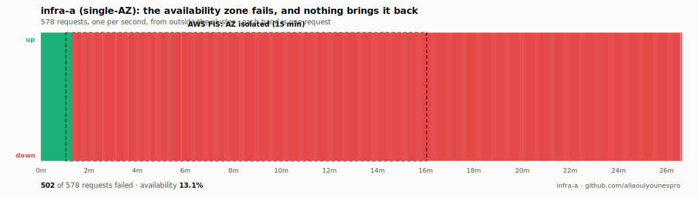
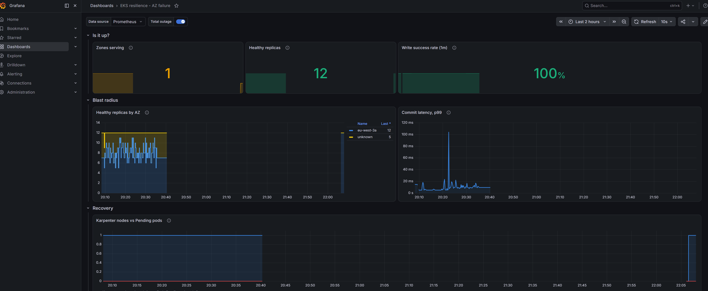
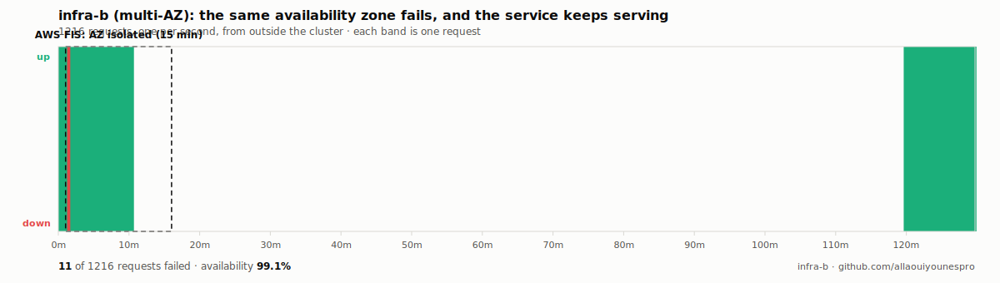
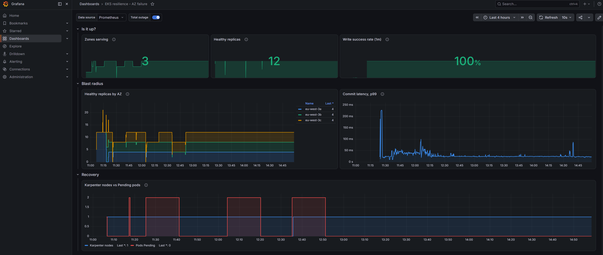

# Results

owner: allaouiyounespro · portfolio: github.com/allaouiyounespro

**Both architectures were built on AWS and destroyed by AWS FIS. These are the
measurements.**

| | infra-a (single-AZ) | infra-b (multi-AZ) |
|---|---|---|
| **RTO** | **never recovered** | **34 s** (median of 3; 28–58 s) |
| **RPO** | **unknown** — nobody survived to ask | **0 s** — proven, 3/3 |
| **Availability during the fault** | **2.71%** | **98.81%** |
| **Human intervention** | **required** | none |
| **Cost** | $285.04/mo | $507.54/mo |

The single-AZ stack did not come back on its own, and the multi-AZ stack never
went down for longer than a database failover. That is the whole project in one
table, and every number in it came from a probe running outside the blast
radius.

---

## infra-a — single-AZ

| metric | value |
|---|---|
| **RTO** | **NOT RECOVERED** — still down at the end of the observation window |
| **RPO** | **UNKNOWN** — see below |
| Availability during the fault | **2.71%** |
| Failed requests | **502 / 516** |
| Zones serving during the fault | none |
| Karpenter nodes launched during the fault | **0** |
| Pods Pending during the fault | **6 / 6** |
| Human intervention required to recover | **yes** |

Run: `results/infra-a/20260714T183355Z/` · fault: AWS FIS, `eu-west-3a`, 15 minutes,
network fully isolated + all nodes stopped.

### What happened

The AZ was cut off and every node in it was stopped. That included the **system
nodes**, which is where the Karpenter controller runs — and infra-a, by
definition, has no second AZ to keep a spare controller in.

**Karpenter died with the workload.** With the controller gone, nothing was left
to provision replacement capacity. The six pods went Pending and stayed Pending.

Then the fault ended, and the service still did not come back.

The Auto Scaling Group had launched replacement instances *during* the network
outage. They booted, could not reach the control plane or ECR, and never joined
the cluster — while EC2 reported them `running`, their status checks green, and
the node group `ACTIVE` with no health issues. **Zombie instances that AWS
believed were healthy and Kubernetes could not see.**

They had to be terminated by hand before the cluster would come back.

> The measured RTO for infra-a is therefore not "twenty minutes". It is **"as long
> as it takes an engineer to understand what is happening and intervene"** —
> which is exactly what `terraform/stacks/infra-b/variables.tf` predicted, in
> writing, before a single measurement was taken.

### Why the RPO is UNKNOWN and not zero

`GET /last` — the endpoint that reports what the database still holds — is served
by the application. Every pod was dead, so nothing was left to answer.

The database itself was `available` throughout, with every row intact. But **we
cannot prove that from inside the experiment**, and an earlier version of the
analysis did the unforgivable thing: it treated an unanswerable question as a
total loss and reported *"76 acknowledged writes lost, RPO 76s"* about a database
that had lost nothing.

An unreadable database means the RPO is unknown. Not zero. Not total loss.
Unknown. `tests/test_analysis.py` now asserts this.

### The observability died with the workload

This is the finding that was not planned, and it may be the most useful one.

| witness | data during the 15-minute outage |
|---|---|
| kube-state-metrics *(in the cluster)* | **3 data points in 90 minutes** |
| Prometheus, Grafana *(in the cluster)* | pod evicted, EBS volume stranded in the dead AZ |
| `chaos/probe.py` *(outside the cluster)* | **578 samples, no gap** |

Every in-cluster observer ran on system nodes inside the target AZ. They died
with it. The Grafana "Pending pods" panel reads **zero** for the entire outage —
not because no pods were pending, but because **nobody was left alive to count
them**.

A dashboard that goes blank at exactly the moment you need it is not a monitoring
system. It is a monitoring system's obituary.

> *"Asking a system to report on its own death produces a suspiciously flattering
> obituary."* — written in `k8s/monitoring/prometheusrule-resilience.yaml` before
> any of this was measured. It is no longer a turn of phrase.

The external probe is why this project has any numbers at all.

*The dashboard, captured live during the fault. Zones serving drops to 1; the
blast-radius panels stop updating around the moment the AZ was cut, because the
data source that fed them was inside it. Compare with infra-b below, where it
never blinks.*

---

## infra-b — multi-AZ

| metric | value |
|---|---|
| **RTO (median of 3)** | **34 s** |
| RTO (min – max) | 28 s – 58 s |
| **RPO** | **0 s** — proven, three times out of three |
| Availability during the fault (median) | **98.81%** |
| Acknowledged writes lost | **0** |
| Runs that never recovered | **0 / 3** |
| Human intervention required | **none** |

Runs: `results/infra-b/2026*/` · same fault as infra-a: AWS FIS, 15 minutes,
network fully isolated + all nodes stopped + forced RDS failover.

### What happened

The AZ holding the RDS writer was cut off and every node in it was stopped. Two
of the six pods died with it. **Four kept serving.**

The 34-second median is the RDS failover, not Karpenter. Karpenter was never the
bottleneck: both of its replicas were alive in the surviving zones and relaunched
the lost capacity while the database was still moving. The 34 USD/month third
system node - the line item nobody puts on the invoice - did what
`terraform/stacks/infra-b/variables.tf` predicted it would, in writing, before
anything was measured.

### The RPO is zero, and this time that is a measurement

infra-a's RPO is **unknown**: no pod survived to answer `GET /last`, so we cannot
say what the database kept. infra-b's is **zero**, and provably so, because pods
in the surviving AZs were alive to be asked. Every write the client was told had
committed was still there afterwards.

That is the difference between "AWS says Multi-AZ gives RPO 0" and "we asked, and
it did".

### The observability survived too

| witness | infra-a | infra-b |
|---|---|---|
| kube-state-metrics | **3 data points in 90 min** | continuous |
| Prometheus / Grafana | pod evicted, EBS stranded in the dead AZ | **kept scraping** |
| `chaos/probe.py` (external) | 578 samples, no gap | 1,216 samples, no gap |

infra-a's dashboard went blank at exactly the moment anyone would have looked at
it. infra-b's stayed up because Prometheus runs two replicas anti-affine across
zones - a fix that only exists because infra-a's failure made the need obvious.

*Three runs in one view. Zones serving holds at 3 throughout. The bottom panel is
the whole story: Pending pods spike to 2 and drain back to 0 three times - the
three faults - while Karpenter relaunches the lost capacity and write success
never leaves 100%. The dashboard is still reporting because it survived the thing
it was reporting on.*

### What infra-b does not do by itself

Every run left a zombie. FIS stops the system node in the target AZ; the ASG
launches a replacement while the AZ is still cut off; that instance boots, never
joins, and stays — `running` in EC2, green status checks, node group `ACTIVE` with
no health issues, and unknown to Kubernetes. Nothing in AWS reconciles it.

After run 3 the system tier was 2/3 and `prometheus-0` sat Pending, because its
EBS volume was stranded in the AZ whose system node was a zombie. Terminating the
zombie brought both back in minutes.

So the honest claim is narrower than "infra-b self-heals":

> **infra-b stays up through an AZ failure without intervention. It does not
> restore its own redundancy without one.**

It survives the *next* failure only if someone cleared the last one. That cost is
real, no AWS console shows it, and it is why `reset-stack.sh` reaps zombies
before each run instead of trusting the platform to.

### The spread of 28–58 s is the point of running it three times

RDS failover time varies. A single run would have reported 58 s or 28 s with
equal confidence and equal meaninglessness. The median with its range is a claim
that survives someone re-running it.

---

## The three discarded runs

Kept in `results/infra-a/_discarded/`, with their autopsies. They are not
results, and none of them is in any number above. They are worth reading anyway,
because each one produced a **well-formed, plausible, completely wrong answer**
that nothing in the tooling flagged.

| run | reported | what was actually wrong |
|---|---|---|
| 1 | RTO 1006 s | Recovery came from FIS restarting the instances it stopped — not from the architecture. |
| 2 | RTO 341 s | Karpenter reclaimed the stopped nodes, so FIS could not restart its own; the action failed; and FIS reacts to a failed action by stopping **every** action, including the network disruption. **The fault was truncated from 15 minutes to five.** A shorter outage, reported as a faster recovery. |
| 3 | RTO 288 s | `scope: availability-zone` only cuts traffic *crossing* the AZ boundary. infra-a lives entirely inside it, so nothing crossed — the "dead" zone happily talked to itself, Karpenter launched replacements **inside the dead zone**, and the service was back in 4m48s with eleven minutes of "outage" left to run. **It was not an AZ failure at all.** |

The third one is the one to dwell on. It measured a real thing, correctly and
reproducibly — the wrong thing. Its only symptom was a Grafana panel showing zero
Pending pods, which looked like a broken graph and was in fact the graph honestly
reporting that Karpenter had never been blocked.

**Every number in this file exists because those three were thrown away.**

---

## Known limitations

Stated plainly, because a portfolio that only lists its strengths is advertising.

1. **One run, not a median.** The result is categorical — the system does not
   recover — so a median of three would not add much. But it is one run, and it
   is labelled as one run.

2. **FIS cannot simulate a real AZ loss.** It implements network disruption with
   network ACLs, and NACLs do not filter traffic *within* a subnet. A genuine AZ
   loss also means EC2 refuses to launch there at all — no FIS action can do
   that. **The measured RTO is a lower bound. Reality is worse.**

3. **The witness app is trivial.** No cache to warm, no leader election, no
   long-lived connections to rebuild. A real application adds its own recovery
   time on top of the infrastructure's.

4. **infra-b survives an AZ, not a region.** There is no cross-region story: the
   read replica that would have been one had to go, because AWS refuses to create
   a Postgres replica for an instance whose master password RDS manages. Between
   credential rotation that works and a DR path that was never going to be
   tested, rotation won. See docs/finops-analysis.md.
